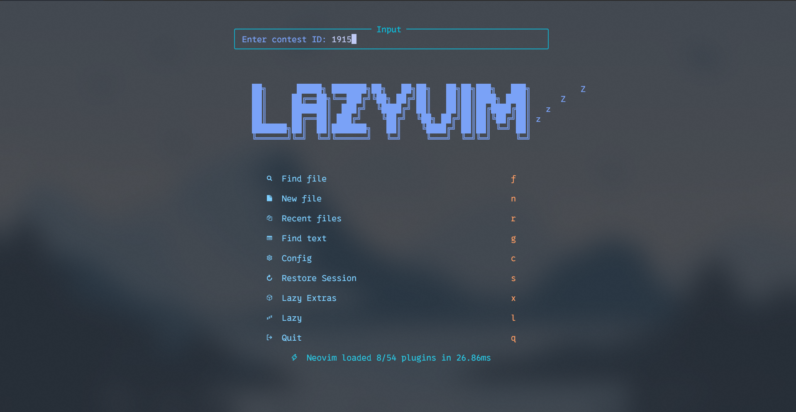

# 💤 LazyVim

A starter template for [LazyVim](https://github.com/LazyVim/LazyVim).
Refer to the [documentation](https://lazyvim.github.io/installation) to get started.

## Requirements

- NeoVim (>= 0.9.0)
- Git (>= 2.19.0)
- a Nerd Font (>= 3.0)
- a C compiler for nvim-treesitter
- node (>=18.0.0) for copilot
- Python (>= 3.6) for the codeforces tool

## Installation

```bash 
cd ~/.config/
git clone https://github.com/BerqiaMouad/Neovim-Setup.git nvim
cd nvim/mouad_codeforces_tool
pip install -r requirements.txt
```

## Usage

After you installed everything, now you just have to run the command `nvim` in your terminal and lazyvim will take care of all the plugins.

```bash
nvim
```

## Some important changes to make

You have to change one simple thing so that the codeforces tool works properly. You have to change the file `auth_codeforces.txt`:

```
your_codeforces_handle
your_codeforces_password
```

## Some important keybindings

- `<space>cp` this will prompt you to enter the contest id like in the image below.

- `<space>cpf` this will prompt you first to type the problem name (A, B, C...) then it will ask you to enter the programming language (currently only cpp or python) like in the images below.


